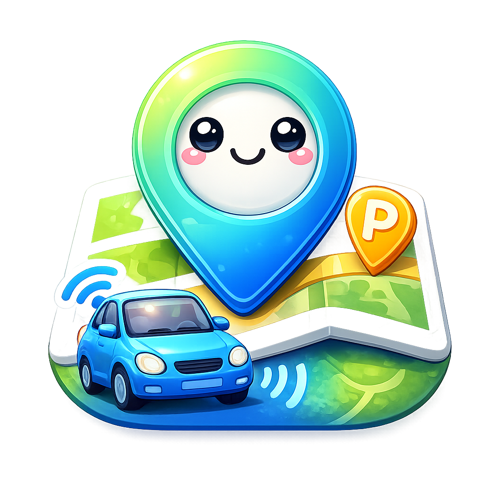

<p align="center">
  
</p>

# AutoGPS by Bonn

> English | **[Italiano](README.it.md)**

**Current version: 2.1.2**

Every time you get in the car you have to remember to turn on GPS. Every time you get out you have to remember to turn it off to save battery. AutoGPS does it for you.

The app detects when your phone connects to your car's Bluetooth (or when Android Auto starts) and turns on GPS automatically. When you disconnect, it turns it off. It also remembers where you parked, so you can find your car without thinking about it. And if something bad happens during the trip, it detects the accident and alerts your emergency contacts with your location.

---

## How it works

AutoGPS listens in the background and reacts to two types of events:

**Bluetooth** — You configure one or more devices (hands-free, car stereo, OBD adapter). When at least one connects, GPS turns on. When all disconnect, it turns off.

**Android Auto** — If you use Android Auto, the app detects it automatically and manages GPS independently from Bluetooth.

The two triggers work in OR logic: as long as one is active, GPS stays on. It only turns off when neither is active.

**Last parking** — Every time you leave the car, the app saves the location and shows it on the map with the address and how long ago you parked. Tapping the map opens Google Maps; the "Navigate here" button starts walking navigation to the car. Everything stays on your device, no data is sent to any server.

**Accident detection** — If during the trip the phone detects a strong impact (via the phone's accelerometer), it waits a few seconds and then checks if the car has stopped. If it remains still for 3 minutes, it shows a red emergency screen — visible even on the lock screen — with two large buttons: "YES, alert emergency contacts" and "NO, it's a false alarm". If you press YES, the app sends an SMS with your exact location (Google Maps link) to the emergency contacts you configured. If you don't press any button within a minute, the app plays an alarm at increasing volume to attract attention. If you still don't respond after another minute, the SMS is sent automatically — so even if you're unconscious, your contacts will be alerted. The alarm always plays through the phone's built-in speaker (not Bluetooth) and pauses any music playing so it can be clearly heard. Detection only works while driving (Bluetooth connected or Android Auto active) and doesn't interfere with the app's normal operation. You can adjust the sensitivity and choose contacts from the main screen.

**Parking widget** — You can add a widget to your phone's home screen that always shows the address of the last parking and how long ago you parked. Tapping the widget opens navigation to the car directly, without opening the app. A green or gray dot indicates whether GPS is active. The widget updates automatically every time you park.

**Language** — The app is available in Italian and English. You can switch language at any time using the toggle in the top right corner of the main screen. Your choice persists even after restarting the app.

The app survives phone restarts, works with the screen off, and has negligible battery consumption.

---

## Requirements

- **Android 8.0 or higher** (Android 9, 10, 11, 12, 13, 14, 15, 16 — all compatible). Tested on Pixel 8 Pro.
- **A computer** (Windows, Mac, or Linux) with a free USB port — needed only for initial setup, just once. After that you can forget about it.

---

## Installation guide

The guide is divided into 9 steps. Steps 2-7 are done only once. It takes about 15-20 minutes the first time.

---

## STEP 1 — Download the APK

An APK is the installation file for Android apps, the same format the Play Store uses internally. AutoGPS is not on the Play Store, so you download it directly from here.

**Click this link:**

**[AutoGPS-by-Bonn-v2.1.2.apk](AutoGPS-by-Bonn-v2.1.2.apk)** (9 MB)

> **Concerned about security?** Read the [Security and Privacy](SECURITY.md) document for full details on how the app protects your data: AES-256 encryption, zero tracking, zero servers, verified SMS.

Clicking the link will take you to a GitHub page showing the file. You won't see anything downloaded — that's just the file "preview" page on GitHub. To actually download the file you need to:

- Click the **three dots icon** (⋮) in the top right of the page, or
- Click the button with the **downward arrow** ("Download raw file")

The file (about 6 MB) will be saved to your computer's **Downloads** folder.

After downloading, **come back to this page** to follow the next steps.

---

## STEP 2 — Prepare the computer

To grant AutoGPS the special permission it needs, you'll use a tool called **ADB** (Android Debug Bridge). In simple terms: it's a program that lets the computer "talk" to the Android phone via USB cable and give instructions that normally can't be given from the graphical interface.

**Good news:** you don't need to install anything complicated. ADB is a simple executable file that you download, extract, and use.

**Android Studio is NOT needed** — it's a huge multi-gigabyte program designed for app developers. For our purposes, downloading just ADB is enough.

### Download ADB

Go to this official Google page:
**https://developer.android.com/tools/releases/platform-tools**

Scroll down to the "Downloads" section and download the version for your operating system:

**Windows:**

1. **Click "Download SDK Platform-Tools for Windows"**
2. Accept the terms and click "Download"
3. A zip file will be downloaded — open it and drag the `platform-tools` folder to your **Downloads** folder (or wherever you prefer, but remember where you put it)

**Mac:**

1. **Click "Download SDK Platform-Tools for Mac"**
2. Accept the terms and click "Download"
3. A zip file will be downloaded — open it and drag the `platform-tools` folder to your **Downloads** folder
4. Alternatively, if you have Homebrew installed, you can open Terminal and type: `brew install android-platform-tools`

**Linux (Ubuntu/Debian):**

1. **Click "Download SDK Platform-Tools for Linux"**, download and extract, or
2. Open the terminal and type:

   ```
   sudo apt install adb
   ```

---

## STEP 3 — Enable Developer Options on the phone

The phone hides some advanced features to prevent users from accidentally changing them. To use ADB you first need to "unlock" these features with a small trick.

**Step by step:**

1. **Open the Settings app** on the phone (the gear icon)

2. **Scroll to the bottom and look for "About phone"** — it might also be called "Phone information", "Device information" or similar. The name varies by manufacturer.

3. **Enter "About phone"** and look for **"Build number"**. On some phones it's hidden inside "Software information" or "Version information". Look around — it's there.

4. **Tap "Build number" 7 times in a row, quickly.** This is not a joke — this is really how it works.

   - After the third or fourth tap a message will appear like: *"You are 3 steps away from being a developer"*
   - Keep tapping
   - On the seventh tap: *"You are now a developer!"* (or a similar message)
   - If the phone has a PIN, it may ask you to enter it

5. **Press the Back button** until you return to the main Settings screen.

6. **You'll now find a new option: "Developer options"** — it might be directly in the main list, or inside **System** > **Advanced** > **Developer options**. It depends on the manufacturer.

---

## STEP 4 — Enable USB Debugging

USB Debugging is the feature that allows ADB to communicate with the phone.

1. **Open "Developer options"** (which you just unlocked in Step 3)

2. **Scroll down** until you find **"USB debugging"** — on some phones it's called "Android debugging"

3. **Turn on the switch** by sliding it to the right (it becomes colored)

4. A warning dialog will appear saying this feature is intended for development. **Tap "OK"** to confirm.

---

## STEP 5 — Connect the phone to the computer

1. **Connect the phone to the computer with a USB cable.** If possible, use the phone's original cable — some cheap cables are "charging only" and don't transfer data.

2. **A notification may appear on the phone** like "Select USB mode" or "USB options". If it appears, **select "File transfer"** (or "MTP"). Do NOT choose "Charging only" — with that option the computer can't communicate with the phone.

3. **A dialog will appear on the phone** saying something like: **"Allow USB debugging?"** with a code called "RSA fingerprint". This is normal — the system wants to confirm that you authorized the computer.

   - **Tap "Allow"**
   - You can also check the box "Always allow from this computer" so it doesn't ask again

**If the dialog doesn't appear:**

- Unplug the USB cable and plug it back in
- Or go back to Developer options, turn off USB Debugging, turn it back on, then reconnect the cable
- Make sure you selected "File transfer" and not "Charging only"

---

## STEP 6 — Open the terminal on the computer

The terminal (also called "command prompt" on Windows) is a window where you type text commands. It looks complicated but you'll only use 3 commands copied from this guide.

**Windows:**

1. Press **Windows key + R** on the keyboard (hold the Windows logo key, then press R)
2. In the small window that appears, type **`cmd`** and press Enter
3. A black window opens — that's the Command Prompt
4. Alternatively: search for **"cmd"** or **"Command Prompt"** in the Windows search bar

**Mac:**

1. Press **Cmd + Space** to open Spotlight
2. Type **"Terminal"** and press Enter
3. Alternatively: go to Applications > Utilities > Terminal

**Linux:**

1. Search for **"Terminal"** in the applications menu
2. Or press **Ctrl + Alt + T** (works on many distributions)

---

## STEP 7 — Install the APK and grant the permission

Now that you have the terminal open and the phone connected, you can do everything in a few commands.

### Navigate to the platform-tools folder

First you need to tell the terminal to "enter" the `platform-tools` folder you downloaded in Step 2.

**Windows** (if you put platform-tools in the Downloads folder):

```
cd %USERPROFILE%\Downloads\platform-tools
```

**Mac/Linux** (if you put platform-tools in the Downloads folder):

```
cd ~/Downloads/platform-tools
```

If you put the folder elsewhere, adjust the path accordingly.

### Verify the phone is recognized

**Copy and paste this command, then press Enter:**

```
adb devices
```

You should see output similar to this:

```
List of devices attached
XXXXXXXX    device
```

The word `device` (or a series of numbers/letters) indicates the phone is recognized. **If you see `unauthorized`**, go back to the phone: there should be an "Allow USB debugging?" notification waiting — tap "Allow".

If you don't see any device, check that the cable is properly connected and that you selected "File transfer" in Step 5.

### Install the APK

**Windows** — if the APK is in the Downloads folder:

```
adb install "%USERPROFILE%\Downloads\AutoGPS-by-Bonn-v2.1.2.apk"
```

**Mac/Linux** — if the APK is in the Downloads folder:

```
adb install ~/Downloads/AutoGPS-by-Bonn-v2.1.2.apk
```

If the APK is in a different folder, replace the path with the correct one. When finished you should see `Success`.

**Alternative without ADB for installation:** you can also transfer the APK to the phone (via cable, WhatsApp, email, Google Drive...) and install it by opening the file from the phone's file manager. Android will ask you to enable installation from "unknown sources" — confirm. In this case you'll still need to run the permission command below.

### Grant the special permission

This is the crucial step. Without it, the app cannot control GPS.

**Copy and paste exactly this command, then press Enter:**

```
adb shell pm grant com.autogps.app android.permission.WRITE_SECURE_SETTINGS
```

If the command succeeds, **no message appears** — the cursor simply moves to a new line. Silence = success. If an error message appears instead, read the "Troubleshooting" section at the bottom of this guide.

---

## STEP 8 — Configure the app

Open AutoGPS on the phone. The first time you'll be asked to grant some permissions.

### Runtime permissions

When the app asks, **grant them all:**

- **Bluetooth** — needed to detect when you connect to the car
- **Location** — required by Android for any app that uses Bluetooth
- **Background location** — when asked, select **"Allow all the time"** and not "Only while using the app". Without this option the app doesn't work with the screen off.
- **Notifications** — needed for the notification confirming the service is active in the background
- **SMS** — needed if you want the app to send emergency messages in case of an accident
- **Overlay (display over other apps)** — if the app shows an orange banner saying "Overlay permission missing", tap it to open settings and grant the permission. It's needed to show the emergency screen even when the phone is locked.

### Add Bluetooth devices

In the **"Bluetooth Trigger"** section, tap **"Add device"** and select your car's Bluetooth from the list (hands-free, car stereo, or any Bluetooth device in the car). You can add as many as you want.

### Android Auto (optional)

If you want the app to work with Android Auto too, in the dedicated section tap **"Open accessibility settings"** and enable the AutoGPS service in the list. It's not mandatory — if you don't use Android Auto, skip this step.

### Battery optimization

If you see an **orange banner** on the main screen, tap it and follow the instructions to exclude AutoGPS from battery optimization. This optimization is an Android feature that "suspends" background apps to save energy — but for AutoGPS it's a problem because it needs to always be listening.

### Emergency contacts (optional)

If you want to use the accident detection feature, in the "Accident Detection" section of the main screen tap "Emergency contacts". From there you can:

- **Import a contact from the phonebook**
- **Enter a contact manually** with name and phone number

Add at least one contact — in case of an accident, the app will send an SMS to all contacts in the list with a link to your location on Google Maps. You can add, edit, or delete contacts at any time.

With the **"Impact detection threshold" slider** you can adjust how sensitive the app should be: a low value detects even light impacts (but may give false alarms), a high value detects only very strong impacts. The default value (2.8G) is a good compromise for most situations.

---

## STEP 9 — Verify everything works

This test takes 5 minutes and is the best way to confirm the setup was successful.

1. **Make sure GPS is off** (you can verify by opening Google Maps — if it can't find your location, it's off)
2. **Connect your car's Bluetooth** from the phone (as you normally would)
3. **Check that GPS turned on by itself** — it should happen within a few seconds
4. **Disconnect Bluetooth**
5. **Check that GPS turns off** — it may take up to 5 minutes, that's normal

If GPS turns on but doesn't turn off, wait a few minutes — the service has an intentional delay to avoid rapid on/off switching.

---

## Troubleshooting

**"The phone is not recognized by the computer" (adb devices shows nothing)**

- Check that the USB cable is properly connected on both ends
- Try a different USB port on the computer
- Make sure you selected "File transfer" on the phone (not "Charging only")
- On Windows: you may need to install the USB drivers for your phone manufacturer. Search Google for "USB drivers [your phone name]"

**"adb devices shows 'unauthorized'"**

- Look at the phone: there should be an "Allow USB debugging?" notification — tap it and choose "Allow"
- If the notification doesn't appear: unplug the cable, turn off and back on USB Debugging in Developer options, then reconnect the cable

**"The adb command is not found" (error like "adb is not recognized")**

- Are you sure you entered the `platform-tools` folder with the `cd` command? Try again.
- On Windows: make sure you extracted the zip file and you're inside the `platform-tools` folder, not outside it
- You can also try dragging the terminal window into the `platform-tools` folder in Explorer — on some Windows versions this opens the terminal already positioned in the right folder

**"The app doesn't turn on GPS after setup"**

- Verify the special permission was granted correctly: reopen the terminal, re-enter the platform-tools folder, and re-run the command `adb shell pm grant com.autogps.app android.permission.WRITE_SECURE_SETTINGS`
- Check that GPS on the phone is completely off before testing (not in "battery saving" mode)
- If you have a Xiaomi, Samsung, Huawei, or Oppo phone, read the "Known limitations" section below

**"The app stops working after a few days"**

- Some manufacturers (especially Xiaomi, Huawei, Oppo) have aggressive battery saving systems that "kill" background apps. Go to [dontkillmyapp.com](https://dontkillmyapp.com), find your phone, and follow the specific instructions for your model.
- Make sure you removed AutoGPS from battery optimization (Step 8, last point)

---

## Updating

When a new version comes out, download the new APK and install it with:

```
adb install -r AutoGPS-by-Bonn-vX.Y.Z.apk
```

The `-r` flag means "reinstall keeping data". Settings are preserved and **you don't need to re-grant the ADB permission** — it remains valid even after updating.

Alternatively, you can install it directly from the phone (without the `adb install` command) — in this case too, settings and the permission are retained.

---

## GPS off behavior

From the app you can choose what happens when all triggers deactivate:

- **Turn GPS off completely** — GPS turns off entirely (default setting)
- **Battery saving mode** — GPS stays active but uses only network and Wi-Fi, without the GPS chip (uses less battery but locates you less precisely)

---

## Known limitations

- GPS control works perfectly on Pixel and devices with stock Android. On phones with heavily customized interfaces (Xiaomi MIUI/HyperOS, Samsung One UI) behavior may vary depending on the system version.
- Some manufacturers (Xiaomi, Huawei, Oppo) have aggressive battery optimizations that can suspend the service. On these devices additional configuration may be needed — see [dontkillmyapp.com](https://dontkillmyapp.com) for specific instructions for your model.
- The accessibility service for Android Auto can be automatically disabled by the system after phone updates. If it stops working, verify it's still active in Settings > Accessibility.
- Accident detection uses the phone's accelerometer. The default threshold (2.8G) is calibrated to distinguish an accident from hard braking, but on very rough roads it may generate false alarms. The threshold is configurable from the app.
- Emergency SMS sending requires an active SIM with sufficient credit. On phones without a SIM, the SMS will not be sent.

---

## Privacy and Security

The app does not communicate with any server, does not collect data, and contains no analytics or trackers of any kind. The last parking location is saved only on your device, encrypted with AES-256 encryption. Everything stays on your phone.

In case of an accident confirmed by the user, the app sends an SMS with the location only to the emergency contacts manually configured by the user. No data is shared automatically and no server is involved — the SMS is sent directly from the phone.

For full technical details on the security measures implemented, see the **[Security and Privacy](SECURITY.md)** document.

---

## Changelog

### v2.1.2 — March 25, 2026

- Emergency SMS auto-sent after 60 seconds of unanswered alarm (protects unconscious users)
- Alarm sound forced to phone's built-in speaker, never Bluetooth
- Music automatically pauses during emergency alarm
- All accident detection timing constants centralized in one config file

### v2.1.1 — March 25, 2026

- English language support with in-app toggle (IT/EN)
- Language preference persists across app restarts

### v2.1.0 — March 24, 2026

- Parking widget for home screen: address, relative time, tap to navigate directly to the car
- GPS status indicator in widget (green/gray dot)
- Dark mode support for the widget
- Post-impact turbulence detection: the app recognizes if the car is rolling after an impact and waits for it to stop before evaluating if it's an accident
- Dynamic GPS stillness threshold based on speed: at 30 km/h 18 meters is enough to consider the car stopped, at 130 km/h 333 meters are needed
- In-app tip to prefer Bluetooth trigger over Android Auto

### v2.0.0 — March 22, 2026

- Automatic accident detection while driving (accelerometer + GPS stillness check)
- Red fullscreen emergency screen visible even on lock screen
- Alarm sound at increasing volume if no response within 60 seconds
- Emergency SMS sending with Google Maps location to configured contacts
- Emergency contacts management (import from phonebook or manual entry)
- Configurable impact sensitivity threshold (1.5G — 5.0G)
- Overlay permission guidance banner

### v1.1.0 — March 21, 2026

- "Last parking" feature: when GPS turns off the app saves the current position
- Map on main screen with pin on last parking
- Text address and "parked N minutes ago" indicator
- Tap on map to open Google Maps; "Navigate here" button for walking navigation to the car

### v1.0.0 — March 18, 2026

- First release
- Multi-device Bluetooth trigger
- Android Auto trigger
- Survives phone restart
- Android 8.0 — 16 compatibility

---

## Is it useful to you?

If AutoGPS makes your life easier, leave a ⭐ on the repository — it's the simplest way to support the project.

## Author and license

Developed by [Andrea Bonacci](https://github.com/AndreaBonn).

The source code is private. The application is free to use.
